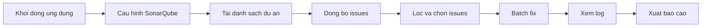
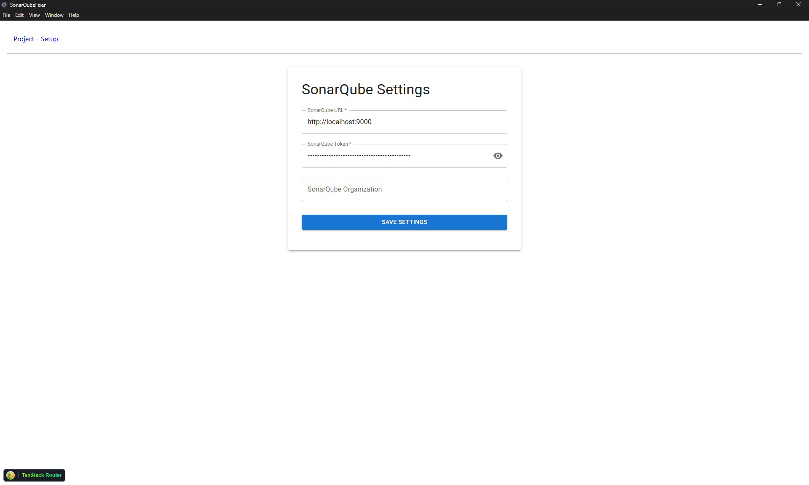
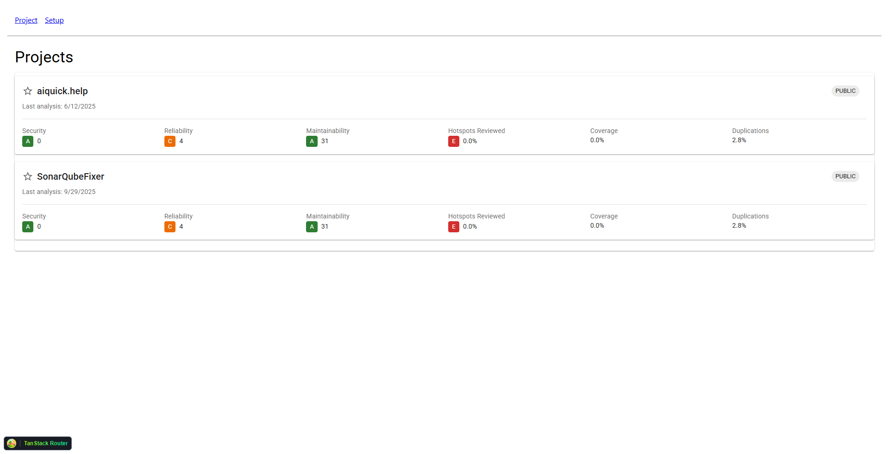
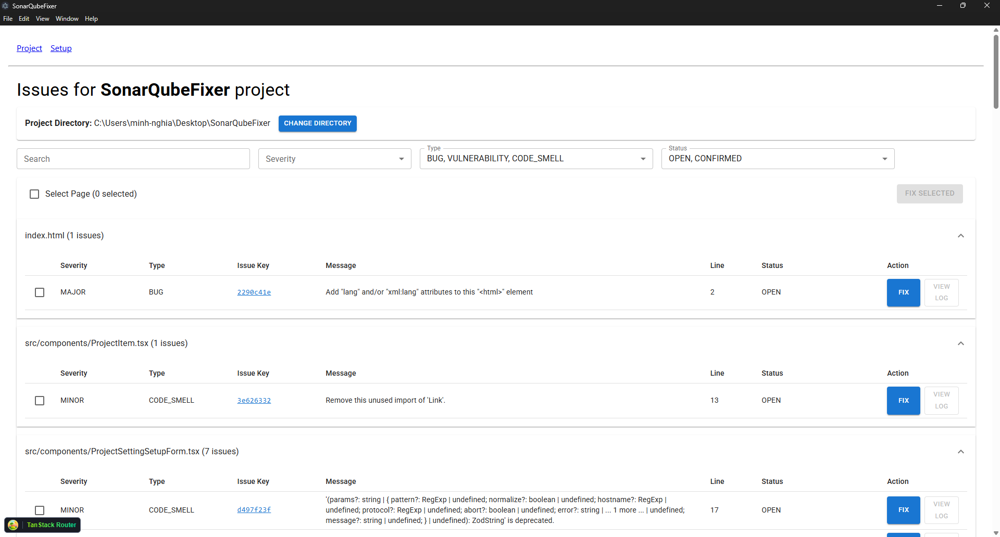

# Giới thiệu chung

SonarQubeFixer là ứng dụng desktop xây dựng trên Electron giúp nhóm phát triển kết nối tới SonarQube, duyệt issues theo dự án, lọc theo tiêu chí và hỗ trợ thao tác hàng loạt để rút ngắn thời gian xử lý nợ kỹ thuật. Ứng dụng tập trung cho Windows, trải nghiệm native, đơn giản và an toàn.

# Giới thiệu chi tiết

Bối cảnh: Trong quá trình kiểm soát chất lượng mã bằng SonarQube, việc xử lý từng issue thường đòi hỏi lập trình viên phải mất nhiều thời gian tìm hiểu nguyên nhân bug, tra cứu giải pháp và thao tác thủ công trên giao diện web, gây khó khăn trong việc tổng hợp, phối hợp và sửa hàng loạt lỗi. SonarQubeFixer được phát triển nhằm giải quyết triệt để vấn đề này bằng cách tự động kết nối tới server SonarQube qua URL và Token cá nhân, đồng bộ hóa danh sách dự án cùng các issue liên quan, cho phép lọc và lựa chọn nhiều issue để batch fix, đồng thời tích hợp OpenAI qua Codex CLI để đề xuất và áp dụng các giải pháp sửa lỗi thông minh, giúp tiết kiệm thời gian, nâng cao hiệu quả xử lý và kiểm soát toàn bộ quá trình qua hệ thống nhật ký chi tiết.

Đối tượng sử dụng: lập trình viên, leader, và QA cần rà soát chất lượng mã, chuẩn hóa phong cách, tối ưu code smell và giảm nợ kỹ thuật.

Phạm vi: hiện tại tập trung trải nghiệm trên Windows. Dev environment khuyến nghị Node.js 22 LTS, quản lý gói bằng npm. Kiến trúc React + Vite chạy trong Electron, định tuyến bằng TanStack Router.

Một số màn hình chính được định nghĩa tại: [src/routes/setup.tsx](src/routes/setup.tsx), [src/routes/projects.tsx](src/routes/projects.tsx), [src/routes/issues/$projectKey.tsx](src/routes/issues/$projectKey.tsx). Luồng batch fix tham khảo tại: [src/routes/issues/hooks/useBatchFix.ts](src/routes/issues/hooks/useBatchFix.ts) và Log viewer: [src/components/issues/LogViewerDialog.tsx](src/components/issues/LogViewerDialog.tsx). Cấu hình và validate được mô hình hóa bởi Zod tại: [src/schemas/settings.ts](src/schemas/settings.ts) và persisted bằng Electron Store: [src/storage/store.ts](src/storage/store.ts).

Sơ đồ luồng sử dụng



# Tính năng chính

- Thiết lập kết nối SonarQube: nhập Server URL và Token, lưu an toàn bằng Electron Store.
- Quản lý dự án: chọn dự án theo key, liên kết thư mục mã nguồn cục bộ để phục vụ quá trình sửa.
- Duyệt và lọc issues: theo Severity, Type, Rule, Status, văn bản tìm kiếm,…
- Chọn nhiều và thao tác hàng loạt: hỗ trợ batch fix cho một số pattern phổ biến; hiển thị tiến trình và kết quả.
- **Sửa lỗi thông minh với OpenAI**: Tự động đề xuất và áp dụng các đoạn mã sửa lỗi cho các issue được chọn bằng cách sử dụng mô hình GPT-4.1 thông qua **Codex CLI**. Tính năng này yêu cầu người dùng phải cài đặt và cấu hình Codex CLI trước.
- Nhật ký theo thời gian thực: xem chi tiết thành công/thất bại, dễ dàng rà soát.
- Giao diện Material Design hiện đại, phím tắt cơ bản, phản hồi nhanh.

# Giao diện







# Yêu cầu cài đặt

- Hệ điều hành: Windows 10/11 x64.
- Node.js: 22 LTS.
- npm: 10+.
- Git để sao chép mã nguồn.
- Máy chủ SonarQube có thể truy cập được (khuyến nghị 9.9 LTS trở lên).
- **OpenAI API Key**: Bắt buộc để sử dụng tính năng sửa lỗi bằng AI.
- **Codex CLI**: Bắt buộc để ứng dụng có thể tương tác với OpenAI và áp dụng các bản vá. Xem hướng dẫn cài đặt tại: [OpenAI Codex CLI](https://developers.openai.com/codex/cli/)

# Cài đặt dự án (Dành cho nhà phát triển)

## Sao chép mã nguồn dự án

Sử dụng Git để clone kho mã:

```bash
git clone https://your.git.server/sonarqube-fixer.git
cd sonarqube-fixer
```

Hoặc tải mã nguồn thủ công và giải nén vào một thư mục làm việc.

## Cài đặt dependencies

Cài đặt bằng npm (ưu tiên npm ci để tái lập môi trường theo [package.json](package.json) và package-lock):

```bash
npm ci
```

Nếu gặp lỗi mạng hoặc cần cập nhật, có thể dùng:

```bash
npm install
```

## Cách chạy ứng dụng ở môi trường phát triển

Chạy Electron Forge kèm Vite cho main/preload/renderer:

```bash
npm run dev
```

Mẹo: để hỗ trợ sinh định tuyến tự động của TanStack Router trong quá trình phát triển, có thể mở thêm một terminal chạy lệnh: 

```bash
npm run watch-routes
```

## Cách build ứng dụng (Dành cho nhà phát triển)

Tạo gói cài đặt Windows bằng Electron Forge:

```bash
npm run make
```

Artifact đầu ra được đặt trong thư mục out/, ví dụ: out/electron-sonarqube-analysis-win32-x64/.

# Hướng dẫn sử dụng cơ bản

1) Mở ứng dụng và truy cập màn hình Setup. Nhập SonarQube Server URL sau đó Lưu.
2) Chuyển tới Projects, tải danh sách dự án, chọn dự án cần làm việc và liên kết thư mục mã nguồn cục bộ.
3) Vào Issues của dự án: tải dữ liệu, thiết lập bộ lọc, chọn một hoặc nhiều issues.
4) Nhấn Fix để bắt đầu quá trình xử lý. Theo dõi tiến trình tại thanh trạng thái và hộp thoại log.
5) Rà soát thay đổi trong IDE của bạn và chạy lại phân tích SonarQube nếu cần.

# Công nghệ sử dụng

- Electron 38 + Electron Forge + Vite cho kiến trúc đa tiến trình.
- React 19, TypeScript 5, TanStack Router 1.
- Material UI 7, styled-components (sử dụng [@mui/styled-engine-sc](https://www.npmjs.com/package/@mui/styled-engine-sc)).
- React Hook Form + Zod cho form và validate.
- electron-store để lưu cấu hình cục bộ.
- sonarqube-web-api-client để truy vấn dữ liệu SonarQube.
- [Codex CLI](https://developers.openai.com/codex/cli/).
- ESLint cho kiểm tra chất lượng mã. Script: xem [package.json](package.json), lệnh lint: npm run lint.

# Tác giả

- Lê Minh Nghĩa  
- Email: minh-nghia@system-exe.com.vn